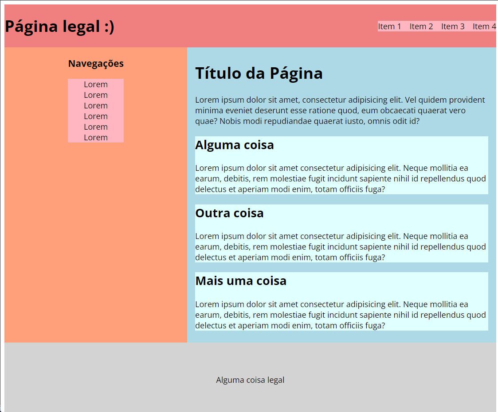

<h1 align="center"> Basic Web Training</h1>

## About

&nbsp;&nbsp;&nbsp;&nbsp;This is a repository that contains the basic web development content presented in the basic technical training of the <b>byron.solutions</b> trainee process.

&nbsp;&nbsp;&nbsp;&nbsp;In this training I trained in <b>HTML</b> and <b>CSS</b> technologies covering basic issues such as web fundamentals, semantics, accessibility, basic CSS and flexbox.

&nbsp;&nbsp;&nbsp;&nbsp;Here I also delved deeper into <b>Git</b> and <b>Github</b> topics, such as <i>Gitflow</i> and collaborative activities that can be viewed in <a src="https://github.com/tomlavez/byronTrainee">this</a> repository.

---

### Technologies

* [HTML](https://developer.mozilla.org/en-US/docs/Web/HTML/Element/html)
* [CSS](https://developer.mozilla.org/en-US/docs/Web/CSS)
* [Git](https://git-scm.com/doc)
* [GitHub](https://docs.github.com/en)

 

Made with 💚 by Eduardo Siles
